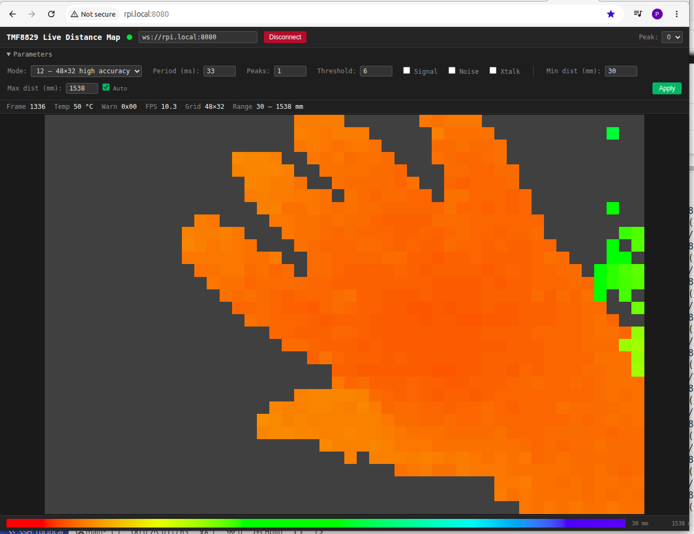

# TMF8829 linux user space project

The TMF8829 MCU Project provides a comprehensive driver and application for the TMF8829 Time-of-Flight (ToF) sensor. This project includes a complete software stack for Linux-based platforms, with support for multiple resolutions, dual mode operation, histogram data capture, and JSON logging.

# Main difference compare to ams-OSRAM/tmf8829_driver_linux_userspace

- CMake build system,
- no need for root/sudo (thanks to libgpiod)
- possibilities to stream frames as json
- sample html page showing streamed frames

## Features

- **Multiple Resolution Support**: 8x8, 16x16, 32x32, and 48x32 pixel resolutions
- **Dual Mode Operation**: High Accuracy (HA) and Default mode switching
- **Histogram Data Capture**: Optional histogram data for detailed analysis
- **JSON Logging**: Compressed JSON file output with metadata
- **JSON Streaming**: One JSON object per frame written to stdout (newline-delimited) for real-time forwarding via `websocketd` or similar tools
- **Live Distance Map Viewer**: Self-contained HTML page (`tools_stream/depth2dmap.html`) displaying a colour-coded 2D distance grid over WebSocket
- **3D Scatter Plot Viewer**: Self-contained HTML page (`tools_stream/scatter3d.html`) rendering all detected targets at their true X/Y/Z positions using Three.js
- **Keystone Angle Calculation**: Calculate X, Y, Z angles from sensor data with optional denoising
- **Flexible Configuration**: Extensive command-line parameters for customization

## System Requirements

- Linux-based operating system (tested on Raspberry Pi)
- GCC compiler with C99 support
- libgpiod v2 (`libgpiod-dev`) for GPIO control
- zlib library for JSON compression

---

## File Architecture

The project is organized into several modules, each with specific responsibilities:

### Core Files

| File | Description | Status |
|------|-------------|--------|
| `main.c` | Application entry point, command-line parsing, main measurement loop | **Modifiable** |
| `tmf8829.c` | Core driver - device initialization, configuration, and control | **DO NOT MODIFY** |
| `tmf8829.h` | Core driver header - public API and data structures | **DO NOT MODIFY** |
| `tmf8829_driver.c` | Linux-specific driver implementation - hardware abstraction layer | **Modifiable** |
| `tmf8829_driver.h` | Linux driver header - driver-specific definitions | **Modifiable** |
| `tmf8829_shim.c` | Platform abstraction layer for I/O operations | **Modifiable** |
| `tmf8829_shim.h` | Shim layer header - platform-independent I/O interface | **Modifiable** |
| `tmf8829_fw.h` | Firmware definitions and constants | **Reference** |

### Frame Parser Module

| File | Description | Status |
|------|-------------|--------|
| `tmf8829_frameparser.c` | Frame parsing logic - extracts result and histogram data | **Modifiable** |
| `tmf8829_frameparser.h` | Parser structures and function declarations | **Modifiable** |

### JSON Logging Module

| File | Description | Status |
|------|-------------|--------|
| `tmf8829_json.c` | JSON file generation and compression | **Modifiable** |
| `tmf8829_json.h` | JSON logger structures and API | **Modifiable** |

### Keystone Module

| File | Description | Status |
|------|-------------|--------|
| `tmf8829_keystone.c` | Angle calculation from 3D sensor data | **Modifiable** |
| `tmf8829_keystone.h` | Keystone structures and API definitions | **Modifiable** |

### Build Configuration

| File | Description |
|------|-------------|
| `CMakeLists.txt` | Build configuration with optional features |

### Directory Structure

```
ams_tmf8829_mcu/
├── main.c                      # Application entry point
├── tmf8829.c                   # Core driver (DO NOT MODIFY)
├── tmf8829.h                   # Core driver header (DO NOT MODIFY)
├── tmf8829_driver.c            # Linux driver implementation
├── tmf8829_driver.h            # Linux driver header
├── tmf8829_shim.c              # Platform abstraction
├── tmf8829_shim.h              # Platform abstraction header
├── tmf8829_fw.h                # Firmware definitions
├── tmf8829_frameparser.c       # Frame parser implementation
├── tmf8829_frameparser.h       # Frame parser header
├── tmf8829_json.c              # JSON logging implementation
├── tmf8829_json.h              # JSON logging header
├── tmf8829_keystone.c          # Keystone angle calculation implementation
├── tmf8829_keystone.h          # Keystone structures and API
├── CMakeLists.txt              # Build configuration
└── README.md                   # Main documentation
```

---

## Porting Guide

This section provides guidelines for porting the TMF8829 driver to other platforms.

### Prerequisites

Before porting, ensure your target platform has:

1. **SPI or I2C Interface**: For communication with the TMF8829 sensor
2. **GPIO Support**: For enable pin and interrupt handling
3. **Standard C Library**: POSIX-compliant C library
4. **Sufficient Memory**: Minimum 4MB RAM (more recommended for histogram/JSON features)

### Porting Steps

#### Step 1: Platform Abstraction Layer (`tmf8829_shim.c`)

The shim layer provides platform-independent I/O operations. Modify the following functions:

| Function | Purpose | Porting Notes |
|----------|---------|---------------|
| `txReg()` | Transmit data to device (I2C/SPI) | Implement platform-specific write operation |
| `rxReg()` | Receive data from device (I2C/SPI) | Implement platform-specific read operation |
| `spi_init()` | Initialize SPI bus | Configure SPI settings and hardware |
| `enablePinHigh()` | Set enable pin to high level | Control GPIO output (active high) |
| `enablePinLow()` | Set enable pin to low level | Control GPIO output (active low) |
| `delayInMicroseconds()` | Microsecond delay | Implement platform delay function |
| `getSysTick()` | Get system timestamp | Return ticks since boot |
| `readProgramMemoryByte()` | Read program memory | Used for firmware access |
| `PRINT_INFO()` | Print information output | Redirect to platform console |
| `PRINT_DEBUG()` | Print debug output | Redirect to platform console (when enabled) |

#### Step 2: Driver Layer (`tmf8829_driver.c`)

Modify hardware-specific initialization:

```c
int tmf8829_probe(tmf8829_chip *chip)
{
    /* Adjust for your platform's device tree or addressing */
    chip->gpiod_enable = YOUR_GPIO_PIN;
    
    /* Select bus type */
    tmf8829_set_busType(chip, BUS_SPI);  // or BUS_I2C
    
    /* Continue with standard initialization */
    return tmf8829_app_init(&chip->tof_core);
}
```

#### Step 3: Memory Configuration

Adjust memory allocation based on available RAM:

```c
/* In tmf8829_frameparser.c */
void tmf8829FrameParserInit(tmf8829FrameParser_t *parser)
{
    /* Reduce buffer sizes if memory is constrained */
    int maxResultSize = YOUR_MAX_RESULT_SIZE;  /* Adjust based on RAM */
    parser->resultBuffer = (uint8_t *)malloc(maxResultSize);
    // ...
}
```

#### Step 4: Build System

Update `CMakeLists.txt` for your platform:

```cmake
# Update toolchain (e.g. via a CMake toolchain file or -DCMAKE_C_COMPILER=...)
set(CMAKE_C_COMPILER your_platform_gcc)

# Update libraries
set(LINK_LIBS m gpiod pthread)
```

#### Step 5: Testing

Verify porting success:

1. **Basic Communication**: Ensure SPI/I2C reads/writes work
2. **Device Identification**: Verify chip ID register reads correctly
3. **Simple Measurement**: Test basic 8x8 mode without histogram/JSON
4. **Full Features**: Gradually enable histogram and JSON features

---

## Frame Parser Pattern

This section provides detailed information about the frame structure, sequence patterns, and parsing of Result frames and Histogram frames for the TMF8829 sensor.

### Frame Structure Overview

Every frame from the TMF8829 device consists of four parts:

```
[Preheader (5 bytes)] [Frame Header (16 bytes)] [Frame Data] [Frame Footer (12 bytes)]
```

The total frame size is calculated as:
```
data_frame_size = preheader_size (5) + header_size (16) + data_size + footer_size (12)
```

---

### Result Frame (ID=0x10)

Result frames contain processed distance and confidence data. The number of result frames per measurement depends on the resolution:

- **8x8/16x16**: 1 result frame per measurement
- **32x32/48x32**: 2 result frames per measurement (sub-frame 0 and sub-frame 1)

#### Result Frame Data Size Calculation

```
data_size = number_pixel_frame * pixel_size
pixel_size = (nr_peaks * (3 + 2 * signal_strength)) + 2 * noise_strength + 2 * xtalk
number_pixel_frame = number_pixel for 8x8 and 16x16
number_pixel_frame = number_pixel/2 for 32x32 and 48x32
```

Where:
- `nr_peaks`: Number of peaks per pixel (1-4)
- `signal_strength`: Enable signal strength (0 or 1)
- `noise_strength`: Enable noise (0 or 1)
- `xtalk`: Enable crosstalk (0 or 1)

---

### Histogram Frame (ID=0x20)

Histogram frames contain raw histogram bin data. The histogram data size is always 25344 bytes.

#### Histogram Frame Structure

- **Total frame size with preheader**: 25377 bytes
- **Histogram data size**: 25344 bytes
- **Payload (header + data + footer)**: 25368 bytes

#### Histogram Data Organization

Each histogram frame contains:
- 4 reference pixel (RP) histograms with 64 bins each (192 bytes)
- Pixel histograms with 64 or 256 bins depending on resolution

**Key characteristics**:
- Each bin is **3 bytes** (not 4 bytes) in little-endian format
- First 3 bytes = bin 0, next 3 bytes = bin 1, etc.
- Bin values represent raw photon counts

#### Histogram Bin Size by Resolution

| Resolution | Pixel Bin Size | Reference Bin Size | Total Frame Data |
|------------|----------------|-------------------|------------------|
| 8x8 | 256 bins | 64 bins | 25344 bytes |
| 16x16 | 64 bins | 64 bins | 25344 bytes |
| 32x32 | 64 bins | 64 bins | 25344 bytes |
| 48x32 | 64 bins | 64 bins | 25344 bytes |

---

### Frame Sequence Patterns

This section describes the frame sequences for different resolutions and modes, including both result and histogram frames.

#### 8x8 Resolution

**Non-Dual Mode (without histograms)**:
```
[Result Frame] → [Repeat]
```

**Non-Dual Mode (with histograms)**:
```
[Histogram T0] → [Histogram T1] → [Result Frame] → [Repeat]
```

**Dual Mode (with histograms)**:
```
[Histogram T0 HA] → [Histogram T1 HA] →
[Histogram T0 Default] → [Histogram T1 Default] →
[Result Frame] → [Repeat]
```

---

#### 16x16 Resolution

**Non-Dual Mode (without histograms)**:
```
[Result Frame] → [Repeat]
```

**Non-Dual Mode (with histograms)**:
```
[Histogram T0] → [Histogram T1] → [Result Frame] → [Repeat]
```

**Dual Mode (with histograms)**:
```
[Histogram T0 HA] → [Histogram T1 HA] →
[Histogram T0 Default] → [Histogram T1 Default] →
[Result Frame] → [Repeat]
```

---

#### 32x32 Resolution

**Non-Dual Mode (without histograms)**:
```
[Result Sub-Frame 0] → [Result Sub-Frame 1] → [Repeat]
```

**Non-Dual Mode (with histograms)**:
```
[Histogram T0] → [Histogram T1] → [Histogram T2] → [Histogram T3] →
[Result Sub-Frame 0] →
[Histogram T4] → [Histogram T5] → [Histogram T6] → [Histogram T7] →
[Result Sub-Frame 1] → [Repeat]
```

**Dual Mode (with histograms)**:
```
[Histogram T0-T3 HA] → [Histogram T0-T3 Default] →
[Result Sub-Frame 0] →
[Histogram T4-T7 HA] → [Histogram T4-T7 Default] →
[Result Sub-Frame 1] → [Repeat]
```

---

#### 48x32 Resolution

**Non-Dual Mode (without histograms)**:
```
[Result Sub-Frame 0] → [Result Sub-Frame 1] → [Repeat]
```

**Non-Dual Mode (with histograms)**:
```
[Histogram T0] → [Histogram T1] → [Histogram T2] → [Histogram T3] →
[Histogram T4] → [Histogram T5] →
[Result Sub-Frame 0] →
[Histogram T6] → [Histogram T7] → [Histogram T8] → [Histogram T9] →
[Histogram T10] → [Histogram T11] →
[Result Sub-Frame 1] → [Repeat]
```

**Dual Mode (with histograms)**:
```
[Histogram T0-T5 HA] → [Histogram T0-T5 Default] →
[Result Sub-Frame 0] →
[Histogram T6-T11 HA] → [Histogram T6-T11 Default] →
[Result Sub-Frame 1] → [Repeat]
```

---

### Histogram Count Reference

| Resolution | Mode | Histograms per Result | Description |
|------------|------|----------------------|-------------|
| 8x8 | Non-Dual | 2 | 2 histogram frames (T0, T1) |
| 8x8 | Dual | 4 | 2 HA + 2 Default |
| 16x16 | Non-Dual | 2 | 2 histogram frames (T0, T1) |
| 16x16 | Dual | 4 | 2 HA + 2 Default |
| 32x32 | Non-Dual | 8 | 4 per sub-frame (T0-T3, T4-T7) |
| 32x32 | Dual | 16 | 8 HA + 8 Default (4 per sub-frame) |
| 48x32 | Non-Dual | 12 | 6 per sub-frame (T0-T5, T6-T11) |
| 48x32 | Dual | 24 | 12 HA + 12 Default (6 per sub-frame) |

---

### Frame Number Sequencing

- Frame numbers increment sequentially (1, 2, 3, ... ), 4 bytes in little-endian format
- All histograms in a measurement group share the same frame number increment

**Example for 8x8 dual mode**:
```
Measurement 1:
  Frame 1: Histogram T0 HA
  Frame 2: Histogram T1 HA
  Frame 3: Histogram T0 Default
  Frame 4: Histogram T1 Default
  Frame 5: Result Frame

Measurement 2:
  Frame 6: Histogram T0 HA
  Frame 7: Histogram T1 HA
  Frame 8: Histogram T0 Default
  Frame 9: Histogram T1 Default
  Frame 10: Result Frame
```

---

### Parsing Logic

#### Result Frame Parsing Flow

```
1. Read preheader (5 bytes) - FIFOSTATUS and SYSTICK
2. Read frame header (16 bytes)
3. Verify Frame ID == 0x10 (result frame)
4. Extract result format from byte 1
5. Calculate pixel_size based on result format
6. For each pixel in frame:
   a. Read noise (2 bytes) if enabled
   b. Read xtalk (2 bytes) if enabled
   c. For each peak (1 to nr_peaks):
      - Read distance (2 bytes, little-endian)
      - Convert: distance_mm = value * 0.25
      - Read SNR (1 byte)
      - Decode confidence/SNR if needed
      - Read signal strength (2 bytes) if enabled
7. Read frame footer (12 bytes)
8. Check frame valid flag (byte 8, bit 0)
9. Check for frame aborted (byte 8, bits 6:7)
10. Verify end of frame marker (0xE0F7)
```

#### Histogram Frame Parsing Flow

```
1. Read preheader (5 bytes)
2. Read frame header (16 bytes)
3. Verify Frame ID == 0x20 (histogram frame)
4. Extract sub-frame number from byte 1
5. Read 4 reference pixel histograms (64 bins each, 3 bytes per bin)
6. Read pixel histograms (64 or 256 bins per pixel, 3 bytes per bin)
7. For each bin:
   - Read 3 bytes in little-endian format
   - Convert to uint32 value
8. Read frame footer (12 bytes)
9. Check frame valid flag (byte 8, bit 0)
10. Check for frame aborted (byte 8, bits 6:7)
11. Verify end of frame marker (0xE0F7)
```

---

### Error Detection

#### Invalid Frame Detection

Frames should be considered invalid if:
1. Frame ID is neither 0x10 (result) nor 0x20 (histogram)
2. Frame valid flag not set (footer byte 0, bit 0)
3. Frame aborted flag set (footer byte 0, bits 6:7 = non-zero)
4. End of frame marker is not 0xE0F7
5. Frame size does not match expected size
6. Frame numbers have large gaps (indicating lost frames)

#### Common Parsing Issues

| Issue | Symptom | Solution |
|-------|---------|----------|
| Misaligned frame data | Incorrect pixel distances or histogram values | Verify byte order (little-endian) and frame structure |
| Lost frames | Gaps in frame number sequence | Increase buffer size or reduce frame rate |
| Invalid resolution | Unexpected number of frames | Check resolution/mode configuration |
| Corrupted distance | Out-of-range distances | Apply distance encoding rule (multiply by 256 if bit 15 set) |
| Invalid histogram data | Incorrect histogram size | Remember histogram bins are 3 bytes, not 4 |

---

## Command Line Parameters

This section provides detailed descriptions of all command-line options.

### General Syntax

```bash
./tmf8829 [options]
```

### Available Options

| Short       | Long                	| Description                                                            		| Default |
|-------------|-------------------------|-------------------------------------------------------------------------------|---------|
| `-m`        | `--measurement`      	| Perform measurement (required for data collection)                     		| Off     |
| `-b <type>` | `--bus <type>`       	| Bus type: 0=I2C, 1=SPI                                               	 		| 1 (SPI) |
| `-d <mode>` | `--mode <mode>`      	| Operating mode (0-13)                                                  		| 0       |
| `-t <sec>`  | `--timeout <sec>`    	| Timeout in seconds (0 = run forever)                                   		| 5       |
| `-i <n>`    | `--iterations <n>`   	| Number of iterations                                                   		| 1800    |
| `-s <n>`    | `--shortiterations <n>` | Number of short iterations                                             		| 100     |
| `-r <n>`    | `--threshold <n>`   	| Confidence threshold                                                   		| 6       |
| `-p <ms>`   | `--period <ms>`      	| Period value in milliseconds                                           		| 33      |
| `-h`        | `--histogram`       	| Enable histogram data (requires `ENABLE_HISTOGRAM` CMake option)        		| Off     |
| `-g`        | `--signal`          	| Enable signal strength information                                     		| Off     |
| `-n`        | `--noise`           	| Enable noise information                                               		| Off     |
| `-x`        | `--xtalk`           	| Enable crosstalk information                                           		| Off     |
| `-o <n>`    | `--objects <n>`     	| Number of peaks per pixel                                              		| 1       |
| `-j`        | `--json`            	| Enable JSON file logging (requires `ENABLE_JSON_LOGGING` CMake option)  		| Off     |
| `-S`        | `--stream`          	| Stream one JSON frame per line to stdout (for `websocketd`)             		| Off     |
| `-k`        | `--keystone`        	| Enable keystone angle calculation (requires `ENABLE_KEYSTONE` CMake option) 	| Off     |
| `-u`        | `--debug`           	| Enable debug output                                                    		| Off     |

### Mode Table (`-d` option)

| Mode 	| Resolution | Description 			| Dual Mode |
|-------|------------|----------------------|-----------|
| 0 	| 8x8 		 | Standard 8x8 		| No 		|
| 1 	| 8x8 		 | Long range 8x8 		| No 		|
| 2 	| 8x8 		 | High accuracy 8x8 	| No 		|
| 3 	| 8x8 		 | Dual mode 8x8 		| Yes 		|
| 4 	| 8x8 		 | Long range dual 8x8 	| Yes 		|
| 5 	| 16x16 	 | Standard 16x16 		| No 		|
| 6 	| 16x16 	 | High accuracy 16x16 	| No 		|
| 7 	| 16x16 	 | Dual mode 16x16 		| Yes 		|
| 8 	| 32x32 	 | Standard 32x32 		| No 		|
| 9 	| 32x32 	 | High accuracy 32x32 	| No 		|
| 10 	| 32x32 	 | Dual mode 32x32 		| Yes 		|
| 11 	| 48x32 	 | Standard 48x32 		| No 		|
| 12 	| 48x32 	 | High accuracy 48x32 	| No 		|
| 13 	| 48x32 	 | Dual mode 48x32 		| Yes 		|

### Parameter Details

#### `-m` / `--measurement`

Enables measurement mode. Without this flag, the application will exit immediately after initialization.

**Example**:
```bash
./tmf8829 -m
```

#### `-b` / `--bus`

Selects communication interface:

- `0`: I2C bus
- `1`: SPI bus (default)

**Example**:
```bash
./tmf8829 -m -b 0  # Use I2C
./tmf8829 -m -b 1  # Use SPI (default)
```

#### `-d` / `--mode`

Selects operating mode (see Mode Table above). Determines resolution and dual mode behavior.

**Examples**:
```bash
./tmf8829 -m -d 0   # 8x8 standard
./tmf8829 -m -d 5   # 16x16 standard
./tmf8829 -m -d 8   # 32x32 standard
./tmf8829 -m -d 11  # 48x32 standard
./tmf8829 -m -d 13  # 48x32 dual mode
```

#### `-t` / `--timeout`

Sets measurement duration in seconds. Use `0` for continuous operation (runs until Ctrl+C).

**Examples**:
```bash
./tmf8829 -m -t 10  # Run for 10 seconds
./tmf8829 -m -t 0   # Run continuously
```

#### `-i` / `--iterations`

Number of measurement iterations for initial capture.

**Example**:
```bash
./tmf8829 -m -i 1800  # 1800K iterations
```

#### `-s` / `--shortiterations`

Number of short iterations (typically for fast initial capture).

**Example**:
```bash
./tmf8829 -m -s 100  # 100K short iterations
```

#### `-r` / `--threshold`

Confidence threshold for filtering results. Pixels with confidence below this value may be marked invalid.

**Example**:
```bash
./tmf8829 -m -r 20  # Higher threshold (more strict)
./tmf8829 -m -r 6   # Lower threshold (sugggested lowest value, more permissive)
```

#### `-p` / `--period`

Measurement period in milliseconds. Controls how often measurements are taken.

**Example**:
```bash
./tmf8829 -m -p 100  # 100 period (slower)
./tmf8829 -m -p 33  # 33ms period (faster, the real fps also depends on iterations setting)
```

#### `-h` / `--histogram`

Enables histogram data capture. This option:

- Must be compiled with `-DENABLE_HISTOGRAM=ON` (the default)
- Adds ~600KB memory usage
- Provides raw histogram bin data for each pixel
- Useful for debugging and signal analysis

**Example**:
```bash
./tmf8829 -m -h -d 8  # 32x32 with histograms
```

#### `-g` / `--signal`

Enables signal strength data in results.

**Example**:
```bash
./tmf8829 -m -g
```

#### `-n` / `--noise`

Enables noise data in results.

**Example**:
```bash
./tmf8829 -m -n
```

#### `-x` / `--xtalk`

Enables crosstalk compensation data in results.

**Example**:
```bash
./tmf8829 -m -x
```

#### `-o` / `--objects`

Sets the number of peaks (objects) to detect per pixel (1-4).

**Example**:
```bash
./tmf8829 -m -o 2  # Detect up to 2 peaks per pixel
```

#### `-j` / `--json`

Enables JSON file logging. This option:

- Must be compiled with `-DENABLE_JSON_LOGGING=ON` (the default)
- Creates compressed JSON files (`.json.gz`)
- Includes all measurement data and metadata
- Provides visualization via HTML viewer

**File Naming Convention**:
```
tmf8829_<UID>-YYYY-MM-DD-HH-MM-SS.json.gz
```

**Example**:
```bash
./tmf8829 -m -j -d 8 -t 10  # 32x32 with JSON logging for 10 seconds
```

#### `-u` / `--debug`

Enables verbose debug output for troubleshooting.

**Example**:
```bash
./tmf8829 -m -u
```

#### `-k` / `--keystone`

Enables keystone angle calculation from 3D sensor data. This option:

- Must be compiled with `-DENABLE_KEYSTONE=ON` (the default)
- Calculates X, Y, and Z angles from the sensor data
- Uses automatic zone pattern for angle calculation
- Includes denoising for more accurate results

**Example**:
```bash
./tmf8829 -m -k -d 11  # 48x32 with keystone angle calculation
```

#### `-S` / `--stream`

Enables real-time JSON streaming to stdout. Each complete frame is written as a single
newline-terminated JSON object so external tools can consume it line by line.

- Works independently of `--json` (file logging); both can be used simultaneously
- All diagnostic output (boot messages, frame grids, FPS stats) is written to **stderr**,
  keeping stdout clean for the JSON data
- Call `fflush(stdout)` is issued after every frame so pipes and WebSocket bridges receive
  data immediately without buffering delays

**JSON format per frame** (same field names as the file logger, no histogram data):
```json
{"info":{"frame_number":N,"read_time":T,"systick_t0":T0,"systick_t1":T1,"temperature":C,"warnings":W},"results":[[{"noise":0,"peaks":[{"distance":D,"signal":S,"snr":R,"x":"X.XX","y":"Y.YY","z":"Z.ZZ"}],"xtalk":0},...],...]}\n
```

**Example — pipe to a simple consumer**:
```bash
./tmf8829 -m -t 0 --stream 2>/dev/null | while read line; do echo "$line" | python3 -c "import sys,json; f=json.load(sys.stdin); print(f['info']['frame_number'])"; done
```

**Example — expose over WebSocket with `websocketd`**:
```bash
websocketd --port 8080 ./tmf8829 -m -t 0 --stream
```

Any WebSocket client connecting to `ws://host:8080` then receives one JSON message per
sensor frame (~11 FPS in 8x8 mode).

#### Live Distance Map Viewer

The `tools_stream/depth2dmap.html` file is a self-contained browser-based viewer that
connects to the `websocketd` WebSocket and renders each frame as a colour-coded 2D grid
in real time. No build step or external dependencies are required.

**Features:**
- Colour scale: red = near, blue = far, dark grey = no target (distance 0)
- Auto-scaling distance range, damped over 30 frames to avoid flicker
- Hover tooltip showing distance, SNR, signal, and X/Y/Z coordinates per pixel
- Live FPS counter, frame number, temperature, and warnings
- Peak selector to switch between peak 0–3 in multi-peak mode
- **Parameters panel**: configure mode, period, peaks, threshold, signal/noise/xtalk from the browser — applied on every (re)connect without restarting `websocketd`

**Quickstart with `--staticdir`** (serves the HTML and the WebSocket on the same port):
```bash
websocketd --port 8080 --staticdir=tools_stream ./build/tmf8829 -m -t 0 --stream
```

Then open `http://<device-ip>:8080` in any browser on the network. The page automatically
connects its WebSocket to the same host and port it was loaded from.

**Configuring parameters from the browser**: open the *Parameters* panel, adjust the
controls, and click **Apply**. The page reconnects and immediately sends a config line to
the new sensor process via stdin:

```
mode=5 period=50 peaks=2 threshold=6 signal=0 noise=0 xtalk=0
```

`websocketd` spawns a fresh `tmf8829` process for each browser connection. When
`--stream` is active the driver waits up to 1 second for this line before starting
measurement, then overrides its command-line defaults with the received values. If no
config line arrives (e.g. CLI-only use) the command-line defaults are used unchanged.

**VS Code task**: Use **Terminal → Run Task → Stream: websocketd** to launch the above
command directly from the editor. The task is configured in `.vscode/tasks.json`.


Hand in view of tmf8829

#### 3D Scatter Plot Viewer

The `tools_stream/scatter3d.html` file renders all detected targets at their true X/Y/Z
positions (in mm from the sensor) as interactive 3D cubes. Uses
[Three.js](https://threejs.org) loaded from CDN — no build step required.

**Display modes** (selectable from the Parameters panel):
- **Only Distance** — all cubes in a uniform blue; lowest GPU cost
- **Show Confidence** — cube colour is a grey shade proportional to SNR (dark = low confidence, white = high)
- **Colored Distance** — cube colour maps Z distance to hue: red = near, blue = far (same scale as the 2D map)

**Controls:**
- **Max Z (mm)** — clips targets beyond this depth and centres the camera on the visible cloud
- **Tilt Axis** — unchecked: front-on view along the sensor's optical axis (matches the 2D map orientation); checked: angled isometric view showing depth; mouse drag orbits freely in both states
- **Parameters panel** — same sensor controls as the 2D viewer (mode, period, peaks, etc.), sent to the driver on every connect

**Quickstart** (same `websocketd` command as the 2D viewer):
```bash
websocketd --port 8080 --staticdir=tools_stream ./build/tmf8829 -m -t 0 --stream
```
Open `http://<device-ip>:8080/scatter3d.html`.

<video src="pictures/hand.webm" autoplay loop muted playsinline width="100%"></video>
Hand in view of TMF8829 shown in the 3D Scatter Plot Viewer.

---

## Building and Installation

### Prerequisites

Install required libraries (Raspberry Pi example):

```bash
sudo apt-get update
sudo apt-get install build-essential
sudo apt-get install zlib1g-dev
sudo apt-get install libgpiod-dev
```

### EVM Configuration

To test it in our TMF8829 EVM, you need modify below 2 lines in `/boot/firmware/config.txt`

```bash
sudo nano /boot/firmware/config.txt
```

Comment out this line avoid conflicting with GUI, restore it to use GUI again.
```
#dtoverlay=tmf8829-overlay-fpc-spi
```

Comment out this line if you want use I2C bus, for SPI bus, it works with/without this change.
```
#dtoverlay=gpio-ir-tx,gpio_pin=25
```

`sudo reboot` is needed after modification.

### Compilation Options

The CMake build supports the following optional features and settings as cache variables:

| Feature | CMake Variable | Description |
|---------|--------------|-------------|
| JSON Logging | `ENABLE_JSON_LOGGING` | Enable compressed JSON file output (default: ON) |
| Histogram | `ENABLE_HISTOGRAM` | Enable histogram data capture (default: ON, ~600KB RAM) |
| Keystone | `ENABLE_KEYSTONE` | Enable angle calculation from 3D data (default: ON) |
| Enable GPIO Pin | `GPIO_ENABLE_PIN` | GPIO pin number used to drive the chip's enable line (default: 16) |

To disable a feature or change a setting, pass `-D<VARIABLE>=<VALUE>` when configuring, e.g.:

```bash
cmake -S . -B build -DENABLE_HISTOGRAM=OFF -DGPIO_ENABLE_PIN=17
```

### Compilation

```bash
cmake -S . -B build
cmake --build build
```

This produces the `tmf8829` executable in the `build/` directory.

### Clean Build

```bash
rm -rf build
cmake -S . -B build
cmake --build build
```

### Installation (Optional)

```bash
sudo cmake --install build
```

This installs the executable to `/usr/local/bin/` (or your platform's default install prefix).

---

## Troubleshooting

### Common Issues

#### Issue: Device Not Found

**Symptom**: `Device not found` or communication errors.

**Solutions**:
1. Check hardware connections (SPI/I2C, power, enable pin)
2. Verify bus type: use `-b 0` for I2C, `-b 1` for SPI

#### Issue: No Data Frames or Frames lost

**Symptom**: Application runs but produces no output data.

**Solutions**:
1. Ensure `-m` flag is specified
2. Check `-t` timeout value (not 0 if expecting timeout)
3. Verify hardware configuration with debug mode
4. Check frame number sequence for discontinuities
5. if Json queue too small and flash write speed too slow, high fps frames may lost

#### Issue: Invalid Histogram Data

**Symptom**: Histogram data appears corrupted or missing.

**Solutions**:
1. Verify `ENABLE_HISTOGRAM` is `ON` in your CMake configuration
2. Check dual mode configuration
3. Ensure sufficient memory is available
4. Run with debug output to trace frame parsing

---

## Additional Resources

- **TMF8829 Datasheet**: Available from ams OSRAM
- **Host Driver Communication (AN001096)**: Frame format specification
- **Application Notes**: Refer to ams OSRAM documentation for detailed sensor operation

---

## License

This project is licensed under GPL-2.0 OR MIT. See LICENSE files for details.

---